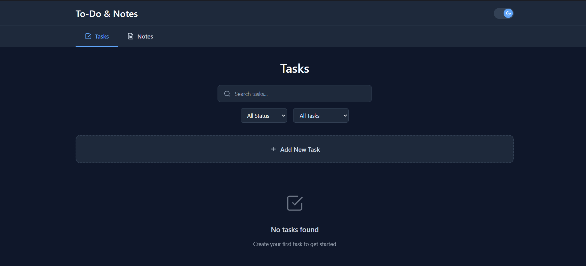
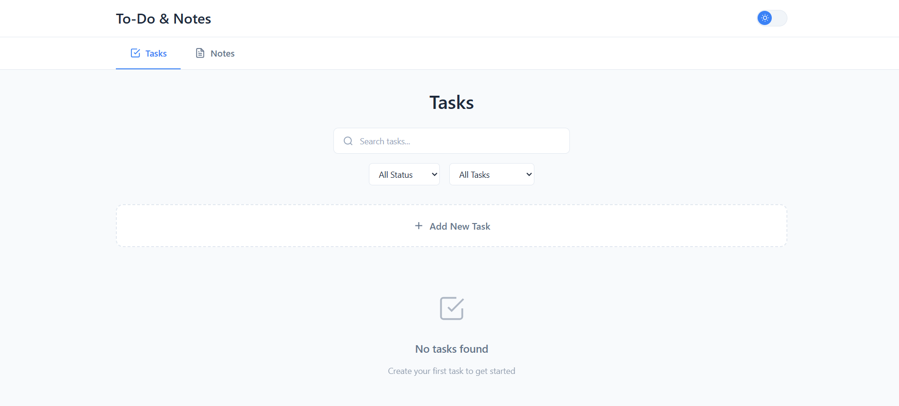
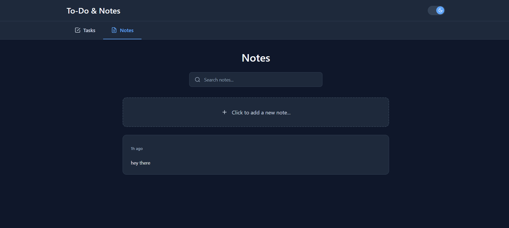

# To-Do & Notes App

A modern, responsive task and notes management application built with React.js and Vite.

## 🛠️ Setup Instructions

### Prerequisites
- Node.js (v22 or higher)
- npm or yarn package manager
- Git

### Installation

1. **Clone the repository**
   ```bash
   git clone https://github.com/Mgodfather/Todo-Notes-Frontend.git
   cd Todo-Notes-Frontend
   ```

2. **Install dependencies**
   ```bash
   npm install
   # or
   yarn install
   ```

3. **Start the development server**
   ```bash
   npm run dev
   # or
   yarn dev
   ```

4. **Open your browser**
   - Navigate to `http://localhost:3000`
   - The app should be running!

### Build for Production

```bash
# Build the project
npm run build

# Preview the production build
npm run preview
```

## 🚀 Features Implemented

### Current Features
- **Task Management**
  - Create, edit, and delete tasks
  - Task status tracking (pending, completed)
  - Priority levels for tasks
  - Image attachments support

- **Notes Management**
  - Create and manage personal notes
  - Organize notes efficiently

- **User Interface**
  - Clean, modern design
  - Responsive layout for all devices
  - Tab-based navigation between Tasks and Notes
  - Toast notifications for user feedback

- **Extra Features**
  - Add "formatDistanceToNow" feature which shows notes/tasks like "4h ago", "2d ago"...etc
  - Dark/Light mode toggle
  - Toast notifications for CRUD operation
  - Drag & Drop for image Upload
  - Search & Filter Functionality for both Task and Notes


## 🔮 Future Improvements

### Planned Features
- [ ] **Search & Filter**
  - Search tasks and notes through API

- [ ] **Categories & Tags**
  - Organize tasks with custom categories
  - Tag system for better organization
  - Color-coded categories

- [ ] **Enhanced UI/UX**
  - Animations and transitions
  - Better color and Theme selection

- [ ] **Data Management**
  - Export tasks/notes to PDF/CSV
  - Bulk operations (delete, update)
  - Data backup and restore


- [ ] **Advanced Features**
  - Task reminders and notifications
  - Calendar integration
  - Recurring tasks
  - Time tracking
  - Productivity analytics

## 📁 Project Structure

```
📦src
 ┣ 📂components
 ┃ ┣ 📂Header
 ┃ ┃ ┣ 📜Header.jsx
 ┃ ┃ ┣ 📜header.module.css
 ┃ ┃ ┣ 📜ThemeToggle.jsx
 ┃ ┃ ┗ 📜themeToggle.module.css
 ┃ ┣ 📂ImageUpload
 ┃ ┃ ┣ 📜ImageUpload.jsx
 ┃ ┃ ┗ 📜imageUpload.module.css
 ┃ ┣ 📂Navigation
 ┃ ┃ ┣ 📜Navigation.jsx
 ┃ ┃ ┗ 📜navigation.module.css
 ┃ ┣ 📂Notes
 ┃ ┃ ┣ 📜AddNoteCard.jsx
 ┃ ┃ ┣ 📜addNoteCard.module.css
 ┃ ┃ ┣ 📜NoteCard.jsx
 ┃ ┃ ┣ 📜noteCard.module.css
 ┃ ┃ ┣ 📜NotesTab.jsx
 ┃ ┃ ┗ 📜notesTab.module.css
 ┃ ┣ 📂Tasks
 ┃ ┃ ┣ 📜SearchAndFilters.jsx
 ┃ ┃ ┣ 📜searchAndFilters.module.css
 ┃ ┃ ┣ 📜TaskCard.jsx
 ┃ ┃ ┣ 📜taskCard.module.css
 ┃ ┃ ┣ 📜TaskModal.jsx
 ┃ ┃ ┣ 📜taskModal.module.css
 ┃ ┃ ┣ 📜TasksTab.jsx
 ┃ ┃ ┗ 📜tasksTab.module.css
 ┃ ┣ 📂Toast
 ┃ ┃ ┣ 📜Toast.jsx
 ┃ ┃ ┣ 📜toast.module.css
 ┃ ┃ ┣ 📜ToastContainer.jsx
 ┃ ┃ ┗ 📜toastContainer.module.css
 ┃ ┗ 📜theme-provider.tsx
 ┣ 📂contexts
 ┃ ┣ 📜AppContext.jsx
 ┃ ┗ 📜ToastContext.jsx
 ┣ 📂hooks
 ┃ ┗ 📜useToast.jsx
 ┣ 📂utils
 ┃ ┣ 📜api.js
 ┃ ┗ 📜dateUtils.js
 ┣ 📜App.jsx
 ┣ 📜app.module.css
 ┣ 📜index.css
 ┗ 📜main.jsx
```

## 🔧 Technologies Used

- **Frontend Framework**: React.js
- **Build Tool**: Vite
- **Routing**: React Router DOM
- **Styling**: CSS Modules
- **State Management**: React Context API
- **HTTP Client**: Axios 

## 📝 API Integration

The app integrates with a backend API for:
- Task CRUD operations
- Notes management

Make sure your backend server is running and accessible at the configured API base URL.

---

# To-Do & Notes App

## 📱 This is how it looks like->

### Task Page


### Tasks Page (Light mode)


### Notes Page


Made with ❤️ by Mayank Kashyap

